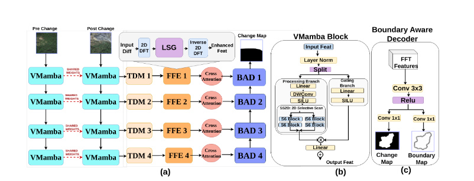

# SF-MambaCD: Spatial and Frequency Aware VMamba for Accurate Mining Change Detection

<p align="center">
  
</p>

<p align="center">
  <a href="https://github.com/swatish434/SF-MAMBA-CD"></a>
  <a href="https://huggingface.co/datasets/HZDR-FWGEL/MineNetCD256"></a>
  
  
  
</p>

---

## 📌 Overview

**SF-MambaCD** is a novel hybrid deep learning framework for detecting surface-level changes in open-pit mining areas from very high-resolution (VHR) bi-temporal satellite imagery. It tackles three core challenges prevalent in mining change detection (CD):

- **Extreme class imbalance** (unchanged regions often exceed 95%)
- **Complex surface textures** (irregular pit boundaries, waste dumps, infrastructure)
- **Poorly defined excavation boundaries** that standard loss functions fail to capture

SF-MambaCD integrates a **Siamese Vision Mamba (VMamba) backbone** with a **frequency-domain-enhanced decoder**, achieving state-of-the-art performance on the [MineNetCD256](https://huggingface.co/datasets/HZDR-FWGEL/MineNetCD256) benchmark.

---

## 🏆 Key Results

Performance on the **MineNetCD256** benchmark dataset:

| Method | OA (%) | Precision | Recall | F1 | cIoU |
|---|---|---|---|---|---|
| A2Net | 91.88 | 0.7218 | 0.5766 | 0.6410 | 0.4718 |
| BIT | 91.18 | 0.6732 | 0.5804 | 0.6233 | 0.4528 |
| ChangeFormer | 87.05 | 0.4857 | 0.5160 | 0.5003 | 0.3337 |
| SNUNet | 89.27 | 0.5829 | 0.5124 | 0.5452 | 0.3750 |
| TinyCD | 89.99 | 0.6250 | 0.5152 | 0.5648 | 0.3936 |
| MineNetCD *(prev. SOTA)* | 92.51 | 0.7120 | 0.6814 | 0.6963 | 0.5343 |
| **SF-MambaCD (Ours)** | **94.12** | **0.7685** | **0.7254** | **0.7463** | **0.5947** |

> SF-MambaCD achieves **+1.74% OA**, **+7.18% F1-score**, and **+11.30% cIoU** over the previous SOTA MineNetCD.

---

## 🏗️ Architecture

SF-MambaCD follows a **bi-temporal Siamese design** and consists of three principal components:

### 1. Siamese VMamba Encoder (Semantic Branch)
- Uses the **Vision Mamba (VMamba)** backbone with a **Selective State Space Model (S6)** to capture long-range spatial dependencies with **linear complexity** — overcoming the quadratic cost of Transformers.
- The **Cross Scan Mechanism (SS2D)** traverses four directional scanning trajectories to ensure every pixel integrates global receptive field information.
- A **Cross-Attention** module aligns bi-temporal features by modeling temporal correlations between pre- and post-change representations.

### 2. Frequency-based Enhancement (FFE) Module
- Computes a **temporal difference map** between projected pre- and post-change features.
- Applies a **2D Discrete Fourier Transform (DFT)** to isolate high-frequency edge anomalies and change cues in the spectral domain.
- Employs **Learnable Spectral Gating (LSG)** via a 1×1 convolutional interaction layer as an adaptive band-pass filter to suppress noise while preserving structural boundaries.
- Reconstructs the refined spatial map via **Inverse DFT**.

### 3. Boundary-Aware Decoder (BAD)
- Uses **SEEDS superpixel guidance** (≈1000 superpixels/image) on pre-change imagery for spatially coherent change maps.
- Predicts both a **Change Mask** and a **Boundary Map** in a multi-task decoding strategy.
- Optimized using a **Boundary-Aware Hybrid Loss**:

$$\mathcal{L}_{total} = \lambda_1 \mathcal{L}_{BCE} + \lambda_2 \mathcal{L}_{Dice} + \lambda_3 \mathcal{L}_{Focal} + \lambda_4 \mathcal{L}_{Bound}$$

  where ground-truth boundaries are dynamically generated via morphological dilation/erosion operations.

### Multi-scale Temporal Difference Module (TDM)
- Isolates high-frequency change signals across multiple scales for robust spectral-temporal feature extraction.

---

## 📁 Repository Structure

```
SF-MAMBA-CD/
│
├── data/                         # Dataset utilities and loaders
│   ├── dataset.py                # MineNetCD256 data loader
│   └── augmentations.py          # Data augmentation pipelines
│
├── models/                       # Model definitions
│   ├── sf_mambacd.py             # Main SF-MambaCD model
│   ├── vmamba_encoder.py         # Siamese VMamba backbone
│   ├── ffe_module.py             # Frequency-based Enhancement module
│   ├── tdm_module.py             # Temporal Difference Module
│   └── boundary_decoder.py       # Boundary-Aware Decoder (BAD)
│
├── losses/                       # Loss functions
│   └── hybrid_loss.py            # Boundary-Aware Hybrid Loss
│
├── utils/                        # Helper utilities
│   ├── metrics.py                # OA, F1, cIoU evaluation metrics
│   ├── seeds_superpixel.py       # SEEDS superpixel generation
│   └── visualization.py          # Grad-CAM and qualitative plots
│
├── configs/                      # Training configuration files
│   └── sfmambacd_config.yaml     # Default training config
│
├── train.py                      # Training script
├── test.py                       # Evaluation/inference script
├── requirements.txt              # Python dependencies
└── README.md
```

---

## ⚙️ Installation

### Prerequisites

- Python ≥ 3.8
- CUDA-compatible GPU (tested on NVIDIA H100, 96GB VRAM)
- PyTorch ≥ 2.0

### Clone the Repository

```bash
git clone https://github.com/swatish434/SF-MAMBA-CD.git
cd SF-MAMBA-CD
```

### Install Dependencies

```bash
pip install -r requirements.txt
```

---

## 📦 Dataset

We evaluate on the **MineNetCD256** dataset — a comprehensive, multi-domain change detection dataset focused on open-pit mining activities.

| Split | Image Pairs |
|---|---|
| Training | 47,743 |
| Validation | 19,355 |
| Test | 4,613 |
| **Total** | **71,711** |

Each image pair consists of 256×256 pixel bi-temporal RGB satellite images with binary change masks.

**Download the dataset from HuggingFace:**

```bash
from datasets import load_dataset
ds = load_dataset("HZDR-FWGEL/MineNetCD256")
```

> 🔗 Dataset: [https://huggingface.co/datasets/HZDR-FWGEL/MineNetCD256](https://huggingface.co/datasets/HZDR-FWGEL/MineNetCD256)

Place the downloaded data under `data/MineNetCD256/` following this structure:

```
data/MineNetCD256/
├── train/
│   ├── A/          # Pre-change images
│   ├── B/          # Post-change images
│   └── label/      # Binary change masks
├── val/
│   ├── A/
│   ├── B/
│   └── label/
└── test/
    ├── A/
    ├── B/
    └── label/
```

---

## 🚀 Training

```bash
python train.py \
  --data_root data/MineNetCD256 \
  --epochs 100 \
  --batch_size 8 \
  --lr_decoder 1e-4 \
  --lr_backbone 1e-5 \
  --num_superpixels 1000 \
  --lambda1 0.3 \
  --lambda2 0.3 \
  --lambda3 0.4 \
  --lambda4 0.5 \
  --patience 15 \
  --output_dir checkpoints/
```

### Optimizer & Scheduler

| Parameter | Value |
|---|---|
| Optimizer | AdamW |
| Decoder LR | 1e-4 |
| VMamba Backbone LR | 1e-5 |
| LR Scheduler | Cosine Annealing |
| Epochs | 100 |
| Batch Size | 8 |
| Early Stopping Patience | 15 epochs |

---

## 🧪 Evaluation

```bash
python test.py \
  --data_root data/MineNetCD256 \
  --checkpoint checkpoints/best_model.pth \
  --output_dir results/
```

Reported metrics: **Overall Accuracy (OA)**, **Precision**, **Recall**, **F1-score**, **cIoU**

---

## 🔬 Ablation Study

| Configuration | OA (%) | Precision | Recall | F1 | cIoU |
|---|---|---|---|---|---|
| V1 — ResNet18 backbone (no VMamba) | 90.45 | 0.7125 | 0.7015 | 0.7156 | 0.5692 |
| V2 — Spatial conv instead of FFE | 92.56 | 0.7265 | 0.7115 | 0.7269 | 0.5869 |
| V3 — No boundary-aware loss | 93.51 | 0.7456 | 0.7149 | 0.7358 | 0.5938 |
| **SF-MambaCD (Full)** | **94.12** | **0.7685** | **0.7254** | **0.7463** | **0.5947** |

Each ablation confirms that VMamba (global context), FFE (frequency-domain analysis), and boundary-aware supervision are all essential, independently contributing to the model's robustness.

---

## 📊 Qualitative Results

<p align="center">
  
</p>

> **Legend:** 🟢 True Positive (TP) | ⬜ True Negative (TN) | 🔵 False Negative (FN) | 🔴 False Positive (FP)

---

## 🔍 Interpretability — Grad-CAM

<p align="center">
  
</p>

Grad-CAM heatmaps confirm that SF-MambaCD selectively activates at **excavation perimeters**, isolating topographical change while suppressing complex background noise.

---

## 👥 Authors

**Ramen Ghosh\***, **Swatish Jena\***, and **Samiran Das**

Indian Institute of Science Education and Research (IISER) Bhopal, India

📧 `{ramen24, swatish21, samiran}@iiserb.ac.in`

*\* Both authors contributed equally to this work.*

---

## 📄 Citation

If you find this work useful, please cite:

```bibtex
@article{ghosh2025sfmambacd,
  title     = {SF-MambaCD: Spatial and Frequency Aware VMamba for Accurate Mining Change Detection},
  author    = {Ghosh, Ramen and Jena, Swatish and Das, Samiran},
  journal   = {arXiv preprint},
  year      = {2025},
  url       = {https://github.com/swatish434/SF-MAMBA-CD}
}
```

---

## 🙏 Acknowledgements

We gratefully acknowledge the authors of [MineNetCD](https://arxiv.org/abs/2407.03971) for the benchmark dataset and evaluation protocol, [VMamba](https://arxiv.org/abs/2401.09417) for the Vision Mamba backbone, and [SEEDS](https://link.springer.com/chapter/10.1007/978-3-642-33709-3_2) for the superpixel algorithm.

---

## 📜 License

This project is released under the [MIT License](LICENSE).
